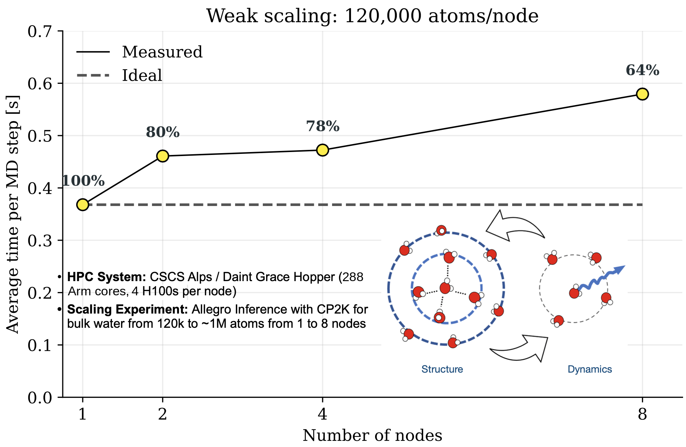

# Gabriele Tocci

*Computational materials scientist, interested in AI and quantum simulation for materials discovery.*

---

I build end-to-end workflows for machine learning interatomic potentials — reference data from
first principles, training, validation against the physics, then production runs at up to a million
atoms on 8 Grace Hopper nodes. I also develop the simulation methods underneath and the HPC
engineering that makes them scale.

Previously at Microsoft Quantum, the University of Zurich, EPFL, and UCL.

### Currently

* **ML potentials in [CP2K](https://github.com/cp2k/cp2k).** Built the bridge between `PyTorch C++`
  and `Fortran 2008` so equivariant ML interatomic potentials run natively inside the quantum
  chemistry suite — [PR #4898](https://github.com/cp2k/cp2k/pull/4898).
* **High-throughput ML workflows on Azure**, for Azure Quantum Elements and materials discovery.
* **Water at solid interfaces.** Machine learning interatomic potentials and ab initio MD, aimed at
  how water orders, sticks and slips against a surface — which is what decides whether you can
  purify it or convert energy with it. SNSF Ambizione and PRACE EU grants, tens of millions of
  CPU-hours on Swiss tier-0 machines.

---

### Selected work

| | |
| :---: | :--- |
|  | **[Slides: Accelerating Materials Science Research with AI and Quantum Simulations on HPC](https://github.com/user-attachments/files/31416392/presentation_research_git.pdf)** |
|  | **[Scaling MLIPs (Allegro) to 1 million atoms with CP2K on ALPS Daint (Grace Hopper nodes)](https://github.com/cp2k/cp2k/pull/4898)** |
|  | **[The role of the water contact layer on hydration and transport at solid/liquid interfaces](https://www.pnas.org/doi/10.1073/pnas.2407877121)**   *PNAS (2024)*   Active learning turned up new water purification phenomena. |
|  | **[SimPoly: Simulation of Polymers with Machine Learning Force Fields Derived from First Principles](https://arxiv.org/abs/2510.13696)**   *arXiv pre-print (2025)*   With Microsoft Research, on ML interatomic potentials. |
|  | **[Friction of Water on Graphene and Hexagonal Boron Nitride from Ab Initio Methods](https://pubs.acs.org/doi/10.1021/nl502837d)**   *Nano Letters (2014)*   The first quantum mechanical account of how water slides on 2D materials. |
